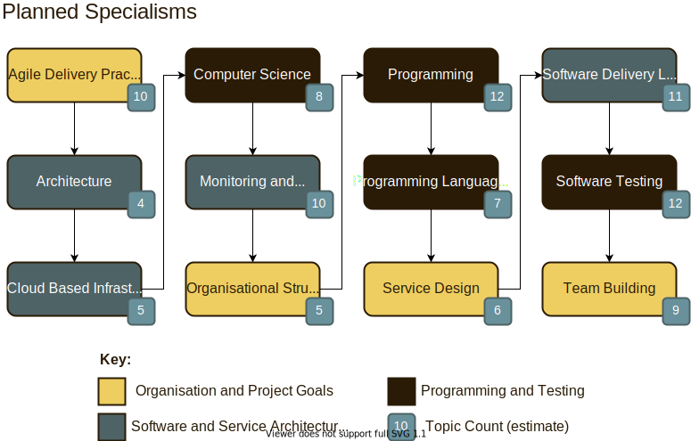

class: title, center, bottom

# Channel Introduction January 2021

???

This content is formatted for slides; to launch the viewer please follow this link:
- https://software-engineering-at-home.github.io/content/slides.html?view=channel/000-Channel-Introduction.md

### Why

Introduce myself to the future audience, and give people an overview of the type of content to expect to find on the channel.

### What

By the end of the topic the audience should have a clear idea of:
- The channel title
- My name
- My background as a programmer, lead software engineer, and delivery manager
- The content and topics available
- That this is a growth project that will develop over time

### How

- By reading the details in this topic 
- By watching a face to camera video on youtube

### Supporting Material

- [/] Slide deck
- [ ] Introduction to the onscreen branding
- [ ] Onscreen topic list
- [ ] Onscreen Twitter feed - with call to action to follow
- [ ] Reminder about YouTube channel

---

## Intro

Hi and welcome to the Software Engineering at Home channel. My name is John and I'm a trained Software Engineer who's worked for the past 20 years either as a programmer, developer, or software engineer. I'm passionate about the field of Software Engineering; both from a hobbiest and professional perspective. I think engineering is a great mindset to have and there are lots of topics I'd like to explore through this channel.

Through my career so far I've had chance to work as a programmer, software team lead, delivery manager, and people manager. I've worked across the English speaking world for British, Australian and American companies, and have developed a sense for how big and small organisations work.

Over time I'll be growing the channel with new topics- many of which have been scoped out already as part of the planning for this channel. 

---

class: diagram

## Content to Expect

???

- [ ] Set the premise - what's the topic, refer to the Why?
- [ ] Tell a story - build a model around the premise using a real world story - either from personal experience or research.
- [ ] Explain the story - explain how the story links back to the premise
- [ ] Extract the value - identify the keys points from the story that explain the topic
- [ ] Practical advice - add personal advice and guidance on top of the story

---

## Conclusion

- [ ] Repeat the presmise, the key points, and the practice advice to close out the video
- [ ] Like, subscribe, and share - support on patreon 

