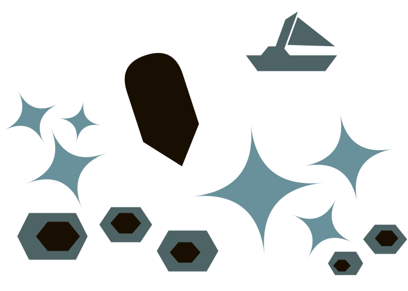

class: title, center, bottom

# Topic Overview for 2021

???

This content is formatted for slides; to launch the viewer please follow this link:
- https://software-engineering-at-home.github.io/content/slides.html?view=channel/001-Topic-Overview-for-2021.md

---

name: intro
class: intro

## Intro

???

To get us started for 2021 - and by way of an extended channel introduction, lets dive into some of the topics that we'll be trying to cover this year. I'll go through each of the specialisms planned out on the Topics page and give some more context to the topics available. If you're interested in a specific topic; feel free to skip ahead in the video to that section. If there are specific topics you'd like to hear more about for future please let me know via feedback in the comments.

If you've not already watched the channel introduction, that's a great place to learn about goals of the channel, and 

So with that out the way, lets dive in to the first specialism in alphabetic order; Agile Delivery Practices.

---

## Agile Delivery Practices

???

Agile Delivery Practices as a specialism covers ways of working; processess and practices that would be considered agile, and how the delivery function supports product, business analysts, programmers, testers, and other roles in a large organisation.

The key topics in this field that I want to cover include general frameworks such as Scrum, Kanban, general techniques such as Prioritisation, Estimation, Retrospectives, Shift Left, and advanced techniques such as Make your queues visible, Culmulative Flow Diagrams, Cost of Delay, and Communcation. These are all topics that I think engineers can benefit from by enabling individuals to make confident decisions about how they organise work, identify value, and make decisions on delivering the most valuable work first.

---

## Architecture

Blue-prints of software systems for houses, and sky scrapers?

???

Architecture as a specialism covers some basics around Communication and the different ways we can model reality, which we can use as a tool to describe and design large and small software systems. 

The key topics in this field that I want to cover include Architecture for Programmers, Drawing Diagrams, Whiteboarding, RFCs, Architectural Decision Records, and then specific patterns such as Event based systems, Data lakes, Authentication and Authorization. These are topics that I think engineers can use to appreciate the breadth and scale of the software systems they are building when they're programming at the lowest level.

---

## Cloud Based Infrastructure

Picture of computers in a cloud?

???

Cloud Based Infrastructure as a specialism covers the major providers such as AWS, Google Cloud, Microsoft Azure - but what I really want to talk about is Infrastructure as Code, Going Serverless, and all the benefits of programmable network architectures. 

The key topics in this field that I want to cover include Instance Compute, Lambdas, setting up DNS Records, Remote Source Control, Load Balancers, Cloud Storage, and Cloud Databases.

---

## Computer Science

Picture of a mathemetical function?

???

Computer Science as a specialism looks at fundementals of a computer system, from the hardware level up to abstract symbol manipulation. I want to explore the fundemental processes of what makes a computer tick, so that when we're writing code, or designing large scale systems, we have an explicit understanding of the low-level mechanisms powering the system.

The key topics in this field that I want to cover include Algoritms, Data Structures, Memory, Byte Code, Simple Data vs Pointers, JSON, XML, CPU Threads - but there are many more that I could explore over time. Computer Science, even without the Software Engineering specialism, is a huge field that touches everything. Everything else I will talk about sits upon these core concepts.

---

## Monitoring and Alerts

Picture of spy glass and alarm bell?

???

I wanted to give a nod to the need to put monitors and alerts in around a software system - but as I began to list out the reasons - I realised more and more how important and complex this is - and how often monitoring is overlooked in the process of building software systems. Why monitor? Do you want to know how your software system is behaving? Or are you just trying to fill a work order and get paid?

The key topics in this field include Why monitor?, Why setup alerts?, Creating good alerts, the process of Triaging issues, Monitoring Tools, Creating graphs and charts, Inspecting Data over Time, Good Dashboards, Use your log data wiseley, and Measure what matters. There's a full time role for Data Scientists to take a long view on this data, but as a Software Engineer its imperative that you have this data at your finger tips to debug and diagnose issues within the software systems you're charged with maintaining. I'm excited to share my thinking with you on these topics.

---

## Organisational Structures

Picture of org chart?

???

Organizations structure themselves in different ways to get the most out of their employees; here we'll talk about different org structures and reflect on how to use that knowledge in your day to day life.

The key topics in this field include The Org Chart, Line of Reporting, Role of Management in Developing Talent, Matrix Organisations, and Teams vs Specialists. Even if you're not working in a team, organising your self and your workflow so that it can be tackled my multiple roles, may be a strategy to help set you up for success in the long run.

---

## Programming

Picture of code blocks interacting?

???

Programming is a vast field of a approaches which explores how we interact with computers through code; everything from abstract symbol manipulation, data structures, APIs, algorithms, linting, and code quality.

Disparate from the specialism Programming Languages, Programming as an Approach, looks at key topics such as Program structure, Code architecture, Object Orientated Programming, Functional Programming, Non-functional side effects, Coupling and cohesion, and so on. There will be some overlap here between Computer Science as a specialism, but Programming should be more practical and less theoretical than the concepts presented elsewhere. 

---

## Programming Languages

Picture of language symbols?

???

Programming Languages are all different ways of providing instructions to computers. In this specialism I want to look at named programming languages; for example how to get started, what the prerequisites are, what integrated development environments (IDEs) are available, and matching test frameworks to use.

I'll try and cover languages I am most familiar with, but am happy to explore new programming languages to compare and contrast. Topics to explore include .NET, Bash, C++, Java, JavaScript, Java !== JavaScript, Python, and Regular Expressions.

---

## Software Delivery Lifecycle

Picture of a value release production cycle?

???

The Software Delivery Lifecycle is the process of releasing value - from code to working software, integrating real world user feedback, and improving the value proposition of a code base while managing technical debt. While I'm not a fan of the monica, it gives me an opportunity to talk about topics that cover a full range of tasks and skills that make up a modern approach to software maintenance.

Key topics I want to talk about include There is an Infinite Amount of Value to be Created, Continuous Integration, Build Pipelines, Source Control, Your code as a crime scene, Pull requests, Code Reviews, Code as a product, Long term maintenance, Load testing, and Non-functional requirements.

---

## Software Testing

Picture of test checklist, pass and fail?

???

In the Software Testing specialism I want to explore the large and complex field of validating software; the more time you spend testing, the more issues you can find - and while automation is important - so is test strategy, and resource allocation.

There are many topics I want to explore from Why test?, When to manually test?, and When to Automate Testing?; cover topics such as Unit Testing, Integration testing, Schema tests, Contract testing, API testing, Smoke Tests... and approaches such as Test Driven Development, Behaviour Driven Development, TDD and BDD being the same thing?, and 5 minute commits.

---

## Service Design

Users and actions surrounding a software system?

???

Service Design as a specialism is an opportunity to talk about next level software development - services are what really matter; products are built and sold, but services are timely and ongoing. How does service based design influence how we approach software engineering?

The key topics I want to explore include Product vs Services, Good Services, Supporting services with software, Separating software tools from the services they provide, Service Catalogues, and Measuring the success of a service.

---

## Team Building

Picture of a team and a leader pointing the way?

???

In the Team Building specialism I want to explore how individuals negotiate with others to form a common goal. What brings people together? What inspires them to action? What gets people out of bed in the morning? What distractions do people face? Team building is an important aspect of supporting and maintaining large software systems.

Key topics I want to explore include Vision and Goals, Quaterly Objectives and key results (OKRs), Strategy vs Tactics, Camaraderie / Comradery, Team Branding, Psychological Safety, Fun things, Team Health, Roles and responsibilities. 

---

class: conclusion

## Where next?

- Like and Subscribe on Youtube: [Software Engineering at Home](https://www.youtube.com/channel/UCoGJPjY5_Fh222iTw3wRE-w)
- Follow on Twitter: [@SoftwareAtHome](https://twitter.com/SoftwareAtHome)
- Support at Patreon: [SoftwareEngineeringAtHome](https://www.patreon.com/SoftwareEngineeringAtHome)
- Email questions to: [software@mkv25.net](mailto:software@mkv25.net)

???

If you've not already, check out the channel introduction for a brief hello from me. You've finished the topic overview for 2021, so you're probably ready to dig into a specialism that interests you. I'll be trying to make content for each specialism in order - so follow the Software Engineering at Home channel on YouTube, follow @SoftwareAtHome on Twitter, and you can also support the channel by subscribing on our Patreon for early access to content - and ask questions to get answers.

Finally, please let me know in the comments which topics you're most interested in - and that will help me prioritise content.

Keep an open mind, and be kind to each other.
